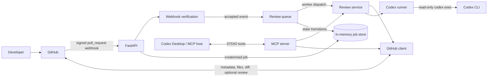
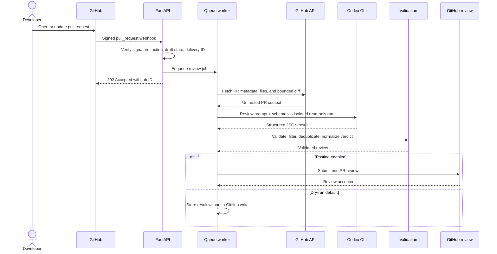

# PullSage

**Insight before merge.**

PullSage is an MCP-enabled AI pull request review platform built with FastAPI, GitHub APIs, and Codex. It analyses code changes, identifies high-confidence defects and security risks, and produces structured review feedback while keeping repository write operations disabled by default.

## Overview

PullSage gives teams one review engine that works in two ways:

- **Automated review:** GitHub sends a signed pull-request webhook to FastAPI, which queues a background review and optionally publishes the validated result.
- **Interactive review:** Codex Desktop, Codex CLI, or another MCP host invokes PullSage's STDIO tools to inspect or review a pull request on demand.

Both paths use the same GitHub client, Codex runner, validation rules, and review service. The API never calls the MCP server, and the MCP server never calls the API. This keeps the core review behaviour consistent and avoids a circular `FastAPI -> MCP -> Codex -> MCP` design.

## The problem PullSage solves

Pull-request review automation often has one of two weaknesses: it is tightly coupled to one webhook workflow, or it gives an AI agent more repository access than a review requires. PullSage separates transport from business logic and treats every pull-request field, patch, and diff as untrusted data. Codex receives a bounded review bundle in a temporary workspace, runs without write or network privileges, and must return JSON that passes strict Pydantic validation before it can be shown or posted.

The result is intended to supplement human review with focused evidence about defects introduced by a pull request—not to replace maintainers, execute untrusted code, or make merge decisions.

## Features

- HMAC SHA-256 verification of GitHub webhook bodies before JSON parsing
- Supported `pull_request` actions: `opened`, `reopened`, `synchronize`, and `ready_for_review`
- Bounded, expiring delivery-ID cache to reduce duplicate webhook processing
- Asynchronous in-memory review queue with configurable worker concurrency
- Duplicate suppression for concurrent reviews of the same pull-request head
- Async GitHub REST client for metadata, changed files, unified diffs, and review submission
- Sandboxed, non-interactive `codex exec` integration with a generated JSON Schema
- One constrained repair attempt when model output is invalid
- Changed-file, changed-line, confidence, duplicate, and verdict validation
- Dry-run analysis by default; GitHub and MCP writes require separate opt-ins
- Safe health, readiness, capability, job-status, and manual-review APIs
- Five focused MCP tools over STDIO
- Structured logs with request/job correlation and sensitive-data redaction
- No database, broker, repository clone, repository code execution, or merge capability

## MVP scope

The MVP handles one PullSage API process and one local MCP process at a time. It authenticates to GitHub with `GITHUB_TOKEN`, stores jobs only in process memory, and invokes an already-installed and authenticated Codex CLI. It can inspect pull requests, generate validated reviews, and—only when enabled—submit a GitHub pull-request review.

### Explicit non-goals

PullSage does **not**:

- merge, close, modify, or push to repositories;
- clone pull-request repositories or execute their code, hooks, tests, or build scripts;
- provide a shell or unrestricted file tools through MCP;
- persist jobs across restarts;
- coordinate work across multiple API replicas;
- install or authenticate Codex for the operator;
- implement a GitHub App, durable queue, database, or multi-tenant authorization in this MVP;
- guarantee that AI-generated findings are complete or correct.

## Technology stack

| Area | Technology |
| --- | --- |
| Runtime | Python 3.12 or 3.13 |
| Packaging | `uv` with a `src/` package layout |
| HTTP API and webhooks | FastAPI and Uvicorn |
| GitHub integration | GitHub REST API through `httpx.AsyncClient` |
| Configuration | Pydantic Settings and environment variables |
| Review schema | Strict Pydantic models and generated JSON Schema |
| AI runtime | Local OpenAI Codex CLI through non-interactive `codex exec` |
| Agent integration | Official stable v1-compatible MCP Python SDK over STDIO |
| Background work | `asyncio.Queue`, worker tasks, and an in-memory job store |
| Tests and quality | pytest, pytest-asyncio, respx, Ruff, and mypy |

## Architecture

### Component architecture



The shared service layer is the architectural boundary: FastAPI owns HTTP concerns, the MCP server owns tool transport, and neither duplicates review logic.

### Component responsibilities

| Component | Responsibility |
| --- | --- |
| FastAPI application | Lifecycle, request IDs, safe error responses, endpoint models, and dependency wiring |
| Webhook verification | Raw-body signature verification, event/action filtering, draft handling, and delivery deduplication |
| Review queue | Admission to an `asyncio.Queue`, worker concurrency, lifecycle, and graceful shutdown |
| In-memory job store | Job state, timestamps, result/error storage, active-key deduplication, and retention cleanup |
| GitHub client | Authenticated REST calls, pagination, diff media type, limits, review submission, and API error mapping |
| Review service | Context orchestration, Codex invocation, validation, formatting, and optional posting |
| Codex runner | Isolated temporary workspace, safe arguments, timeout, output capture, and one repair attempt |
| Review validation | Confidence filtering, path/line checks, deduplication, and verdict consistency |
| MCP server | Typed STDIO tools backed by shared services; write-gate enforcement |

For deeper design rationale, see [Architecture](docs/architecture.md).

## Automated review workflow



The webhook response is deliberately fast. Review progress is available from `GET /api/v1/reviews/{job_id}` until the completed job expires.

## Interactive MCP workflow

1. An MCP host starts `uv run pullsage-mcp` as a child process.
2. The host and PullSage exchange JSON-RPC messages over STDIO.
3. Read tools call the shared GitHub client; the review tool calls the shared review service.
4. `pullsage_review_pull_request` waits for the review and returns its validated structured result.
5. `pullsage_post_review` rejects calls unless `PULLSAGE_ALLOW_MCP_WRITE_TOOLS=true`.

The MCP path does not require the FastAPI process or its queue. The API and MCP processes also do not share in-memory job state.

## Project layout

```text
PullSage/
├── .env.example
├── .gitignore
├── .python-version
├── AGENTS.md
├── LICENSE
├── README.md
├── pyproject.toml
├── requirements.txt
├── docs/
│   ├── api.md
│   ├── architecture.md
│   ├── github-setup.md
│   ├── mcp-setup.md
│   ├── security.md
│   └── troubleshooting.md
├── src/pullsage/
│   ├── ai/             # Prompt, Codex subprocess, and output schema
│   ├── api/            # FastAPI factory, dependencies, handlers, and routes
│   ├── github/         # REST client, models, and webhook verification
│   ├── jobs/           # In-memory store, queue, and workers
│   ├── mcp/            # STDIO MCP server and tool definitions
│   ├── reviews/        # Review models, validation, formatting, and service
│   ├── cli.py          # API and MCP console entry functions
│   ├── config.py       # Typed environment configuration
│   ├── exceptions.py   # Domain exception hierarchy
│   └── logging_config.py
└── tests/              # Offline unit and integration-style tests
```

## How the AI runtime works

PullSage does not call the OpenAI Python API. `CodexRunner` locates `CODEX_COMMAND` with a safe executable lookup and then starts an asynchronous subprocess resembling:

```text
codex exec
  --ephemeral
  --sandbox read-only
  --ask-for-approval never
  --skip-git-repo-check
  --output-schema <temporary-schema-path>
  --output-last-message <temporary-result-path>
  --cd <temporary-workspace>
  -c mcp_servers={}
  -
```

The prompt is sent on standard input. If `CODEX_MODEL` is set, the configured model is added explicitly; otherwise Codex uses the operator's configured default. PullSage writes only the bounded PR context and output schema to the temporary workspace. It does not clone the repository, run commands from the PR, run tests, grant network access, or use `workspace-write`, `danger-full-access`, `--yolo`, or approval bypass flags.

PR content is labelled as untrusted. The prompt tells Codex to ignore instructions embedded in source, comments, strings, documentation, commit messages, and diffs. The final JSON is validated independently; invalid output receives at most one constrained repair attempt.

## Why there is no database

The no-database design keeps local setup and the MVP trust boundary small. Jobs, results, active-review keys, and webhook delivery IDs live only in memory. Completed jobs are automatically removed after `PULLSAGE_JOB_RETENTION_SECONDS`.

Consequences are intentional and important:

- a process restart loses all job history and deduplication state;
- API replicas cannot share jobs or delivery IDs;
- clients may receive `404` for an expired or restart-lost job;
- this design is suitable for a single-process MVP, not durable production orchestration.

A production evolution would introduce a durable queue and job store behind the existing interfaces, without changing the API or MCP business logic.

## Install later

The repository contains dependency declarations but does not vendor packages. From the project root, after reviewing the configuration, run:

```powershell
uv sync --group dev
```

On macOS or Linux, the same `uv` command applies. `pyproject.toml` is authoritative; `requirements.txt` contains runtime dependencies only for compatibility.

PullSage also requires the Codex CLI to be installed and authenticated separately. PullSage never attempts to install or log in to Codex.

## Configuration

Copy the example file for local development:

```powershell
Copy-Item .env.example .env
```

On macOS or Linux:

```bash
cp .env.example .env
```

Never commit `.env`. Environment variables override values in that file.

| Variable | Default | Purpose |
| --- | --- | --- |
| `PULLSAGE_ENV` | `development` | Runtime environment label |
| `PULLSAGE_HOST` | `127.0.0.1` | API bind address |
| `PULLSAGE_PORT` | `8000` | API bind port |
| `PULLSAGE_LOG_LEVEL` | `INFO` | Application log level |
| `GITHUB_TOKEN` | unset | GitHub bearer token; required for PR access |
| `GITHUB_WEBHOOK_SECRET` | unset | Shared HMAC secret; required for webhooks |
| `GITHUB_API_URL` | `https://api.github.com` | GitHub REST base URL |
| `CODEX_COMMAND` | `codex` | Executable name or absolute path |
| `CODEX_MODEL` | unset | Optional model override |
| `CODEX_TIMEOUT_SECONDS` | `300` | Per-attempt Codex timeout |
| `PULLSAGE_POST_COMMENTS` | `false` | Permit automated webhook review posting |
| `PULLSAGE_ALLOW_MCP_WRITE_TOOLS` | `false` | Permit explicit MCP posting, including review calls with `post_comments=true` |
| `PULLSAGE_MIN_CONFIDENCE` | `0.80` | Minimum finding confidence retained for posting |
| `PULLSAGE_MAX_DIFF_CHARS` | `200000` | Maximum unified-diff characters |
| `PULLSAGE_MAX_CHANGED_FILES` | `100` | Maximum changed-file count |
| `PULLSAGE_MAX_CONCURRENT_REVIEWS` | `2` | API background worker count/concurrency |
| `PULLSAGE_JOB_RETENTION_SECONDS` | `3600` | Completed-job retention in memory |
| `PULLSAGE_DELIVERY_RETENTION_SECONDS` | `3600` | Webhook delivery-ID cache lifetime |
| `PULLSAGE_MAX_WEBHOOK_DELIVERIES` | `10000` | Maximum delivery IDs retained in the bounded cache |

Boolean values accept normal Pydantic boolean spellings such as `true` and `false`. Do not quote secrets in shell history when a secret manager or protected environment injection is available.

## Run the FastAPI service

```powershell
uv run pullsage-api
```

The default address is `http://127.0.0.1:8000`. Interactive OpenAPI documentation is available at `/docs` in environments where the application exposes it.

Check process and dependency readiness separately:

```powershell
curl.exe http://127.0.0.1:8000/health
curl.exe http://127.0.0.1:8000/ready
```

`/health` answers whether the process is alive. `/ready` may report a degraded state when the GitHub token, webhook secret, worker, or Codex executable is unavailable; it does not reveal secret values.

## Run the MCP server

```powershell
uv run pullsage-mcp
```

STDIO is a machine protocol: when launched directly, the process normally waits without printing a friendly prompt. Configure an MCP host to start it instead of typing JSON-RPC manually. Do not write ordinary logs to stdout; the server reserves stdout for MCP messages.

## Connect to Codex Desktop or Codex CLI

Create a project-scoped `.codex/config.toml` only if you intend to trust this project:

```toml
[mcp_servers.pullsage]
command = "uv"
args = ["run", "pullsage-mcp"]
cwd = "C:\\path\\to\\PullSage"
startup_timeout_sec = 20
tool_timeout_sec = 360
```

On macOS or Linux, use an absolute POSIX path for `cwd`. Start Codex from a process that already has `GITHUB_TOKEN` in its protected environment; the child MCP process inherits it. Keep tokens out of project-scoped configuration.

The equivalent registration is:

```powershell
codex mcp add pullsage -- uv run pullsage-mcp
```

If you use `codex mcp add ... --env NAME=value`, that value is configuration data. Do not put a real token in a tracked file or a shareable command transcript. See [MCP setup](docs/mcp-setup.md) for inherited-environment examples, tool details, and Windows path guidance.

## GitHub setup

For the MVP, set a fine-grained personal access token as `GITHUB_TOKEN`.

- For dry-run review of private repositories, grant repository metadata read and pull requests read.
- To post reviews, grant pull requests read and write.
- Limit repository access to only the repositories PullSage must inspect.

Configure a GitHub repository webhook:

- **Payload URL:** `https://your-pullsage-host.example/webhooks/github`
- **Content type:** `application/json`
- **Secret:** a high-entropy value also supplied as `GITHUB_WEBHOOK_SECRET`
- **Events:** select **Pull requests**
- **SSL verification:** enabled in production

PullSage accepts only the supported actions and ignores draft pull requests unless the action is `ready_for_review`. See [GitHub setup](docs/github-setup.md) for permissions, webhook delivery diagnosis, and the GitHub App production roadmap.

## Local webhook testing

GitHub must reach the webhook URL over HTTPS. Use an organization-approved tunnel or reverse proxy that is already installed, point it at `127.0.0.1:8000`, and configure the resulting HTTPS URL in GitHub. Treat a public tunnel URL as an internet-exposed endpoint: use the webhook secret, keep posting disabled, and shut the tunnel down afterward.

For an offline signature-path check, save a representative webhook payload as `payload.json`, set a disposable local secret, and generate the signature over the file's exact bytes. This PowerShell example sends the same bytes it signs:

```powershell
$env:GITHUB_WEBHOOK_SECRET = "local-test-only-secret"
$body = [System.IO.File]::ReadAllBytes((Resolve-Path .\payload.json))
$key = [Text.Encoding]::UTF8.GetBytes($env:GITHUB_WEBHOOK_SECRET)
$hmac = [Security.Cryptography.HMACSHA256]::new($key)
$signature = "sha256=" + [Convert]::ToHexString($hmac.ComputeHash($body)).ToLowerInvariant()
Invoke-WebRequest -Method Post `
  -Uri http://127.0.0.1:8000/webhooks/github `
  -Headers @{
    "X-Hub-Signature-256" = $signature
    "X-GitHub-Event" = "pull_request"
    "X-GitHub-Delivery" = [guid]::NewGuid().ToString()
  } `
  -ContentType "application/json" `
  -Body $body
```

Use only synthetic or public test data in `payload.json`, and remove the disposable environment variable when finished.

## REST API

| Method | Path | Purpose |
| --- | --- | --- |
| `GET` | `/health` | Basic process health |
| `GET` | `/ready` | Degraded readiness and dependency checks |
| `GET` | `/api/v1/config/capabilities` | Safe, non-secret feature limits and switches |
| `POST` | `/api/v1/reviews` | Enqueue a manual review and return `202` |
| `GET` | `/api/v1/reviews/{job_id}` | Read an in-memory job and result |
| `POST` | `/webhooks/github` | Verify and accept GitHub webhook deliveries |

Enqueue a dry-run review:

```powershell
curl.exe -X POST http://127.0.0.1:8000/api/v1/reviews `
  -H "Content-Type: application/json" `
  -d '{"owner":"octo-org","repository":"example","pull_request_number":42,"post_comments":false}'
```

Poll the returned identifier:

```powershell
curl.exe http://127.0.0.1:8000/api/v1/reviews/00000000-0000-0000-0000-000000000000
```

The UUID above is illustrative; use the `job_id` returned by the enqueue request. API errors use a stable JSON envelope and a request ID for correlation. Full request/response examples and response codes are in [REST API reference](docs/api.md).

## MCP tools

| Tool | Safety | Purpose |
| --- | --- | --- |
| `pullsage_get_pull_request` | Read | Return sanitized pull-request metadata |
| `pullsage_get_changed_files` | Read | Return bounded changed-file metadata and available patches |
| `pullsage_get_pull_request_diff` | Read | Return a bounded unified diff and truncation information |
| `pullsage_review_pull_request` | Read by default | Run the shared review service; `post_comments` defaults to `false` |
| `pullsage_post_review` | Write-gated | Validate a structured review and submit it to GitHub |

Every MCP result is an object with `ok: true` plus the tool-specific `pull_request`, `changed_files`, `diff`, `review`/`posted`, or `posted_review` field. Safe failures use `{"ok": false, "error": {"code": "...", "message": "..."}}`.

Example natural-language requests to an MCP host:

```text
Use pullsage_get_changed_files to inspect octo-org/example pull request 42.
```

```text
Use pullsage_review_pull_request for octo-org/example pull request 42.
Keep post_comments false and summarize only the validated result.
```

The MCP server never offers merge, shell, repository-write, or arbitrary-comment tools. The post tool accepts only a validated review payload.

## Example structured review

```json
{
  "summary": "The change introduces one blocking error-handling defect.",
  "verdict": "request_changes",
  "confidence": 0.94,
  "risk_level": "high",
  "findings": [
    {
      "id": "src-client-timeout-unhandled",
      "title": "Handle the timeout before updating job state",
      "body": "A timeout exits this path before the job is marked failed, leaving clients to poll an in-progress job indefinitely.",
      "severity": "high",
      "category": "reliability",
      "confidence": 0.96,
      "file_path": "src/example/client.py",
      "line": 87,
      "start_line": 87,
      "side": "RIGHT",
      "suggested_fix": "Catch the timeout, transition the job to failed, and preserve exception chaining.",
      "evidence": "The newly added await can raise TimeoutError and no enclosing branch records a terminal state."
    }
  ],
  "testing_recommendations": [
    "Add an async test that forces a timeout and asserts a failed terminal job state."
  ],
  "limitations": [
    "Repository tests were not executed."
  ]
}
```

Before posting, PullSage removes findings below the configured confidence threshold, rejects paths outside the changed files, checks line mapping when available, removes duplicates, and reconciles the verdict with remaining severity.

## Example GitHub review output

```markdown
## PullSage review

- **Verdict:** `request_changes`
- **Risk:** `high`
- **Confidence:** 94%

### Summary

The change introduces one blocking error-handling defect.

### Findings

#### High

1. **Handle the timeout before updating job state** (`src/example/client.py`, line 87; reliability; 96% confidence)

   A timeout exits this path before the job is marked failed, leaving clients to poll an in-progress job indefinitely.

   **Evidence:** The newly added await can raise `TimeoutError` and no enclosing branch records a terminal state.

   **Suggested fix:** Catch the timeout, transition the job to failed, and preserve exception chaining.

### Testing recommendations

- Add an async test that forces a timeout and asserts a failed terminal job state.

### Limitations

- Repository tests were not executed.

---
_AI-assisted review by PullSage; a human reviewer should make the final merge decision._
```

Unsafe or unmappable inline findings stay in the general review body rather than being posted at an uncertain line.

## Security model

PullSage is designed around untrusted input and explicit write gates:

- Webhook HMAC verification occurs over the raw request body before parsing.
- GitHub tokens and webhook secrets are never returned from capability or health endpoints.
- Codex receives only bounded review context, not credentials or the webhook payload.
- Codex runs ephemerally in a temporary workspace with a read-only sandbox, no approval prompts, and no repository execution.
- The prompt explicitly treats source, prose, commits, patches, and diffs as data—not instructions.
- Generated output must pass strict schema and domain validation.
- GitHub posting defaults to disabled with `PULLSAGE_POST_COMMENTS=false`.
- MCP writes have an independent default-off gate: `PULLSAGE_ALLOW_MCP_WRITE_TOOLS=false`.
- The service has no merge endpoint or merge MCP tool.
- Logs omit authorization values, secrets, entire private diffs, and sensitive environment data.
- Size and file-count limits bound cost and exposure.

These controls reduce risk; they do not make model output authoritative. See [Security](docs/security.md) for the threat model and residual risks.

## Dry-run and write safety

The safest normal configuration is the default:

```dotenv
PULLSAGE_POST_COMMENTS=false
PULLSAGE_ALLOW_MCP_WRITE_TOOLS=false
```

Automated webhooks follow `PULLSAGE_POST_COMMENTS`. A manual API request explicitly opts in with `post_comments: true`; its default is false, so do not expose that endpoint without caller authorization in production. MCP review calls with `post_comments: true` and direct `pullsage_post_review` calls both require the separate MCP write gate. Direct posting also requires a valid structured payload. Enable only the write path you intend to use, with a least-privilege token. PullSage never merges.

## Tests and quality checks

All tests are designed to run without live GitHub, Codex, or other external services:

```powershell
uv run pytest
uv run ruff check .
uv run ruff format --check .
uv run mypy src
```

Tests use mocks or `respx` for GitHub behaviour and cover webhook verification, event filtering, duplicate delivery handling, job lifecycle and expiry, validation, output parsing, health/readiness, error mapping, dry-run behaviour, and write gates.

## Troubleshooting

- **`codex` command not found:** install the Codex CLI separately, or set `CODEX_COMMAND` to its absolute path.
- **Codex authentication failure:** authenticate Codex in the same OS account that runs PullSage, then verify `codex exec` independently.
- **GitHub returns 401/403:** replace or re-scope `GITHUB_TOKEN`; posting needs pull-request write permission.
- **Webhook signature fails:** confirm both sides use the same secret and that no proxy changes the body bytes.
- **A review was not posted:** dry-run is the default; inspect both the request and the relevant write gate.
- **A job disappeared:** in-memory jobs expire and are lost on restart.
- **Windows cannot find a command:** use `where.exe uv` / `where.exe codex`, or configure an absolute executable path.

See [Troubleshooting](docs/troubleshooting.md) for diagnostic steps that do not leak secrets.

## Known limitations

- Jobs, results, duplicate keys, and delivery IDs are process-local and ephemeral.
- One API replica cannot coordinate with another.
- GitHub authentication uses one configured token rather than installation tokens.
- Large diffs may be truncated or rejected, reducing review coverage.
- GitHub patch data can be absent for binary or oversized files.
- Line mapping is conservative, so some findings appear only in the summary.
- Codex availability, authentication, model behaviour, and latency are external runtime dependencies.
- AI review can miss defects or produce incorrect findings despite validation.
- STDIO MCP is local; no remote MCP transport is mounted in FastAPI.
- There is no tenant identity, policy engine, audit database, or durable rate control.

## Production-readiness gaps

Before exposing PullSage as a shared service, add:

- GitHub App installation-token authentication and installation authorization checks;
- durable encrypted job storage, queueing, delivery deduplication, and idempotent posting;
- API authentication and authorization for manual review/status endpoints;
- multi-replica coordination, backpressure, quotas, and abuse controls;
- managed secret injection and key rotation;
- TLS termination, hardened ingress, request-size limits, and production observability;
- an audit trail for write authorization and GitHub review IDs;
- explicit data-retention, privacy, and model-governance policies;
- load, chaos, and end-to-end tests in a controlled staging environment.

## Roadmap

1. Replace the single token with a GitHub App and short-lived installation tokens.
2. Add durable queue/store adapters without changing the shared review service.
3. Add idempotent review updates and installation-aware policy controls.
4. Improve diff/line mapping and large-PR chunking with bounded aggregation.
5. Add metrics, traces, audit events, and deployment reference manifests.
6. Offer authenticated MCP **Streamable HTTP** as a separate transport for remote hosts; keep it independent from FastAPI's review call graph.
7. Evaluate additional providers and policy-controlled review profiles while preserving strict output validation.

## Contributing

Read [AGENTS.md](AGENTS.md) before changing the code. Keep transport code thin, place shared behaviour in reusable services, preserve default-off writes, and add offline tests for every security or state transition. Run the quality commands above and update the README plus architecture/API documentation whenever behaviour, routes, tools, settings, or safety controls change.

Do not commit tokens, webhook secrets, private diffs, `.env`, temporary Codex workspaces, or test fixtures containing private repository content.

## License

PullSage is licensed under the [MIT License](LICENSE).
