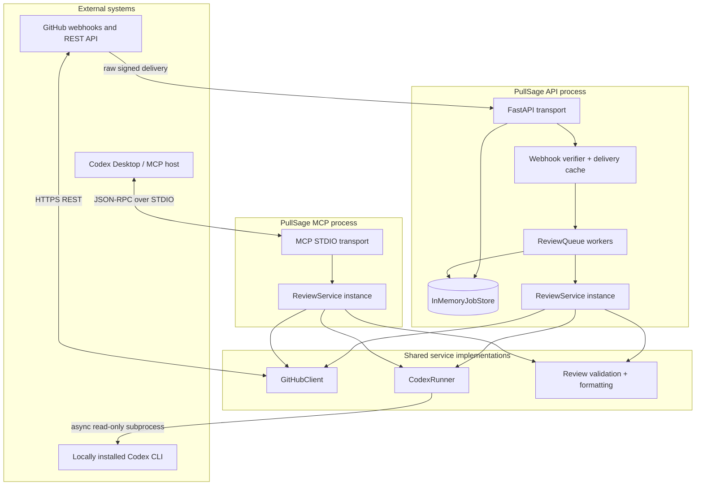
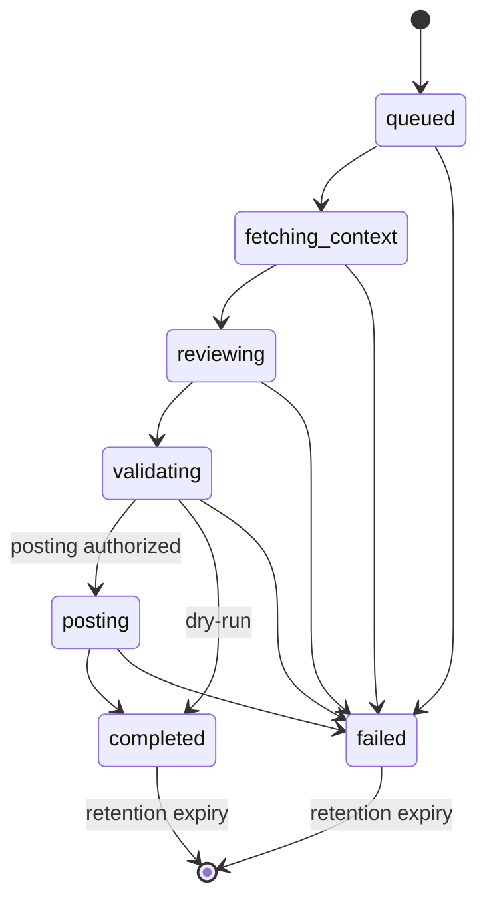
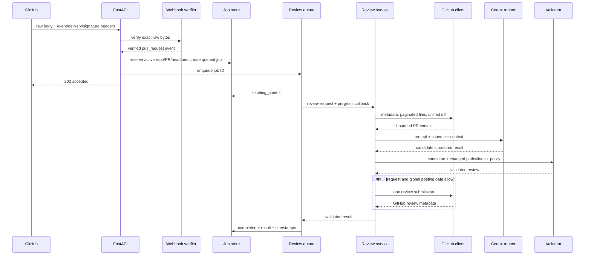

# PullSage architecture

## Purpose and architectural goals

PullSage is a production-minded MVP for AI-assisted GitHub pull-request review. Its architecture aims to:

1. keep repository content untrusted from ingress through model output;
2. make read-only analysis the default and every external write explicit;
3. reuse one review implementation across automated HTTP and interactive MCP workflows;
4. return webhook responses quickly while reviews run asynchronously;
5. bound memory, API context, model context, concurrency, and runtime;
6. remain useful on a developer workstation without a database or broker;
7. expose clear seams for durable production infrastructure later;
8. work on Windows, macOS, and Linux without shell-specific subprocess behaviour.

## System context

PullSage has two independently launched entry points:

- `uv run pullsage-api` starts FastAPI, its in-memory store, and background queue workers.
- `uv run pullsage-mcp` starts a local MCP server using STDIO.

They share Python service implementations, not a network call or a singleton process. Running one does not start or require the other.

The diagram shows two `ReviewService` instances because API and MCP are separate OS processes. They are constructed from the same class and policies. The MCP process does not see API jobs or the API's delivery cache.

## Major design decisions

### Shared service layer, separate transports

FastAPI owns HTTP, webhooks, application lifespan, background jobs, and response serialization. MCP owns tool registration, input schemas, STDIO, and MCP-safe error responses. Both construct and call the same `GitHubClient`, `CodexRunner`, `ReviewService`, review validator, and formatter.

This prevents:

- divergent validation between webhook and interactive reviews;
- the API depending on a local MCP subprocess;
- a circular `FastAPI -> MCP -> Codex -> MCP` architecture;
- transport concerns leaking into the review domain.

### Local Codex CLI instead of an SDK API call

`CodexRunner` invokes an already-installed `codex exec` asynchronously. The operator controls Codex authentication and its default model. An optional `CODEX_MODEL` chooses an explicit model.

Each attempt uses a fresh temporary workspace containing only:

- a bounded, serialized PR review context;
- Pydantic's generated JSON output schema;
- the final result file written by Codex.

The subprocess receives the prompt through standard input and uses ephemeral, read-only, no-approval arguments. It does not clone the repository, execute repository code, run tests, or receive GitHub credentials. A timeout bounds each attempt. Invalid JSON/schema output gets one constrained repair attempt, never an open-ended retry loop.

### Strict output plus independent domain validation

JSON Schema constrains generation, but it is not the final trust boundary. PullSage parses the result into strict Pydantic models and then applies domain rules:

- confidence is in `[0, 1]`;
- finding paths are in the changed-file set;
- line numbers are positive and map reasonably to changed right-side lines where data exists;
- duplicate findings are removed;
- findings below `PULLSAGE_MIN_CONFIDENCE` are omitted from posting;
- `approve` is incompatible with retained high/critical findings;
- `request_changes` is reserved for meaningful blockers;
- empty findings receive an honest, non-invented summary.

When inline positioning is uncertain, formatting keeps the finding in the general review body.

### Default-off writes

Analysis is dry-run by default. Automated webhook jobs use `PULLSAGE_POST_COMMENTS`; manual API calls explicitly opt in with `post_comments=true`; and MCP review calls with `post_comments=true` plus direct MCP post calls require `PULLSAGE_ALLOW_MCP_WRITE_TOOLS=true`. Direct MCP posting accepts only a validated review model.

The MCP surface has no merge, repository-write, arbitrary-comment, or shell tool. The API has no merge route.

### In-memory jobs

The API process uses `asyncio.Queue` and an `InMemoryJobStore`. This is deliberately not a disguised durable system:

- queued and completed jobs disappear on restart;
- webhook delivery deduplication disappears on restart;
- state is not shared between processes or replicas;
- a completed job is removed after the retention interval;
- an expired ID returns not found.

This choice makes local operation simple while preserving interfaces that can later be backed by durable adapters.

### STDIO MCP first

The first MCP client is local Codex Desktop/Codex CLI, so STDIO is the narrowest transport. Standard output is reserved for MCP protocol messages; logs go to standard error.

Authenticated **Streamable HTTP** is a roadmap item for remote MCP hosts. It should be introduced as a separately authenticated deployment surface with origin, session, tenant, and rate controls. It should not make FastAPI call MCP or casually mount the MCP server into the review API.

## Component boundaries

### Configuration and composition

The typed settings object reads environment variables once at application composition time. Dependencies are passed into services rather than fetched from global mutable objects. Sensitive settings are never included in readiness, capability, or error payloads.

The API lifespan:

1. creates shared dependencies;
2. starts the configured queue workers and cleanup activity;
3. exposes the ready application;
4. stops accepting work on shutdown;
5. cancels/drains worker tasks according to the queue's shutdown policy;
6. closes async HTTP resources.

The MCP entry point creates its own settings, GitHub client, runner, and review service, registers tools, and starts STDIO.

### GitHub boundary

`GitHubClient` is the only component that knows GitHub REST URLs, headers, pagination, media types, and review submission payloads. It uses `httpx.AsyncClient` with request timeouts and maps responses into domain exceptions:

- authentication/authorization failure;
- rate limiting, including safe reset/retry context when available;
- repository or PR not found;
- general GitHub API failure;
- review posting failure.

It sends the GitHub API version header and the appropriate media type, including unified-diff retrieval. Limits are checked while gathering context so overly large PRs do not flow to Codex.

### Webhook boundary

The webhook route reads the raw bytes once. Verification uses `X-Hub-Signature-256`, HMAC SHA-256, and constant-time comparison before JSON parsing. The verified delivery then passes through:

1. event-name filtering;
2. supported-action filtering;
3. draft policy;
4. bounded `X-GitHub-Delivery` duplicate cache;
5. minimal payload extraction;
6. queue admission and active-head deduplication.

Unsupported events/actions and drafts are acknowledged safely without starting a review. A newly accepted review returns HTTP `202` promptly.

### Job boundary

Each job records:

- UUID `job_id`;
- owner, repository, and pull-request number;
- source (for example, webhook or manual API);
- controlled status;
- creation, start, and completion timestamps;
- safe error text;
- validated review result when available.

State transitions are monotonic during ordinary execution:

The worker records a safe terminal error for expected failures and logs an internally useful, redacted exception for unexpected ones.

### Review service boundary

`ReviewService` orchestrates one review:

1. fetch metadata and changed files;
2. enforce file count;
3. fetch and bound the unified diff;
4. build the untrusted review context;
5. invoke Codex;
6. validate and filter output;
7. format an optional GitHub review;
8. post one review submission if authorized;
9. return the validated result and timing information to its caller.

The service should not depend on FastAPI request objects, MCP contexts, or global queue state. Optional progress callbacks allow the API worker to update job status without coupling the service to the store.

## Automated data flow

No webhook secret, GitHub token, authorization header, or irrelevant delivery payload enters the Codex context.

## Interactive MCP data flow

Read tools call `GitHubClient` directly for a single bounded operation. `pullsage_review_pull_request` calls `ReviewService` and waits from the MCP user's perspective while the implementation remains asynchronous. It does not enqueue an API job and does not return a job ID.

`pullsage_post_review` first checks the MCP write gate, validates the complete structured payload, applies review validation/formatting rules, then delegates a bounded review submission to `GitHubClient`. An arbitrary string comment is never accepted.

## Concurrency model

### API process

- A single `asyncio.Queue` provides FIFO admission.
- `PULLSAGE_MAX_CONCURRENT_REVIEWS` controls worker count/concurrent reviews.
- Each worker processes one review at a time.
- HTTP requests remain responsive while GitHub and Codex work awaits.
- An active review key based on repository, PR number, and head SHA prevents duplicate concurrent work where the head SHA is known.
- The bounded delivery cache prevents immediate replay of the same GitHub delivery.
- The store protects compound mutations with async synchronization where concurrent workers could collide.
- Completion/failure releases the active key.
- Retention cleanup removes terminal jobs and expired delivery IDs.

This is concurrency, not durability. A subprocess termination, process crash, or restart can lose work.

### MCP process

Tool calls use async GitHub/review services under the MCP SDK. No API queue or store is shared. Host and SDK concurrency still encounters upstream GitHub limits and local Codex capacity; production deployments should add explicit per-client quotas.

## Bounds and backpressure

PullSage applies several independent bounds:

| Bound | Configuration or mechanism |
| --- | --- |
| Concurrent API reviews | `PULLSAGE_MAX_CONCURRENT_REVIEWS` |
| Changed files | `PULLSAGE_MAX_CHANGED_FILES` |
| Unified diff characters | `PULLSAGE_MAX_DIFF_CHARS` |
| Codex attempt duration | `CODEX_TIMEOUT_SECONDS` |
| Model repair attempts | One |
| Terminal job lifetime | `PULLSAGE_JOB_RETENTION_SECONDS` |
| Delivery-cache lifetime | `PULLSAGE_DELIVERY_RETENTION_SECONDS` |
| Delivery-cache entries | `PULLSAGE_MAX_WEBHOOK_DELIVERIES` |
| HTTP calls | Client request timeout and pagination limits |

Queue depth and request body limits should become explicit deployment controls before public production exposure.

## Failure handling

Expected failures are domain exceptions translated into safe HTTP and MCP errors. A failure should answer three questions without exposing secrets: what category failed, whether the operator/client can act, and which request/job ID can correlate internal logs.

| Failure | Behaviour |
| --- | --- |
| Invalid/missing webhook signature | Reject before parsing with HTTP `401` |
| Unsupported event/action or draft | Safe acknowledgement; no job |
| Duplicate delivery/active head | Safe acknowledgement or existing-job response; no duplicate work |
| Missing GitHub/Codex configuration | Degraded readiness; review fails safely if attempted |
| GitHub authentication failure | Typed safe error; token never echoed |
| GitHub rate limit | Typed error; safe retry/reset information if available |
| PR not found | Typed not-found response |
| Too many files/diff too large | Typed limit failure before Codex |
| Codex missing | Setup-focused error; no installation attempt |
| Codex timeout/runtime failure | Terminate attempt, clean workspace, record failed job |
| Invalid output | One constrained repair; then typed failure |
| GitHub posting failure | Review job fails safely without pretending a write succeeded |
| Worker shutdown | Stop/cancel deterministically and record/log affected state where possible |
| Unexpected exception | Redacted stack trace internally; generic client response |

Timing fields/logs cover context fetch, Codex execution, validation, posting, and total duration. Entire private diffs are not normal log fields.

## No-database implications

The API cannot promise exactly-once processing. It provides best-effort duplicate suppression within one live process. GitHub may retry a webhook after a restart; an operator may also enqueue the same head manually. Review posting should therefore remain conservative, and a production implementation should persist delivery IDs, active keys, and posted-review identities.

Job polling is also opportunistic. A client should treat `404` after a restart or retention window as "no longer available," not proof that the review never ran.

No database means there is no historical audit trail, tenancy boundary, usage accounting, or model-output retention beyond process memory. Logs are not a substitute for a transactional audit store.

## Future scaling path

The current boundaries make an incremental production path possible:

1. **GitHub App:** replace the static token provider with short-lived installation tokens and authorize every repository against an installation.
2. **Durable store:** implement the job-store interface over a transactional database with encrypted sensitive fields and retention policy.
3. **Durable queue:** implement queue leasing, retries, dead-letter handling, idempotency keys, and backpressure.
4. **Distributed deduplication:** persist GitHub delivery IDs plus repo/PR/head review keys and posted-review IDs.
5. **Worker separation:** run API admission and review workers as independently scaled services.
6. **Chunked review:** process very large PRs in bounded units, then validate and aggregate without losing evidence provenance.
7. **Policy/auth layer:** authenticate manual API users and authorize organization, repository, write mode, model, and limits.
8. **Observability:** add metrics, traces, audit records, SLOs, and redaction-tested log export.
9. **Remote MCP:** add authenticated MCP Streamable HTTP with TLS, origin checks, session isolation, rate limits, and tenant authorization.

Even after these changes, transport layers should continue to call the shared review service. The API should not call MCP, and remote MCP should not become a privileged back door around service write policies.

## Deployment assumptions

The MVP assumes:

- one trusted operator controls the process environment;
- outbound HTTPS to the configured GitHub API is permitted;
- Codex CLI is installed and authenticated for that same OS account;
- the API bind address remains loopback unless a hardened reverse proxy is intentionally configured;
- any public webhook endpoint terminates TLS and preserves the exact request body;
- secrets arrive through protected environment injection or an untracked local `.env`;
- local filesystem permissions protect temporary workspaces while they exist.

Review [Security](security.md) before changing these assumptions.
